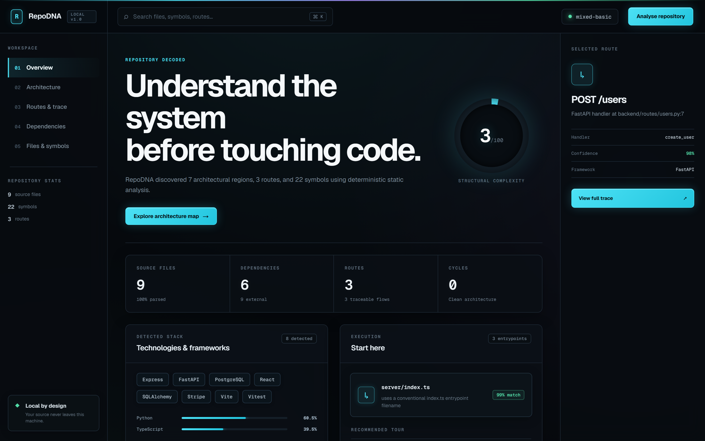
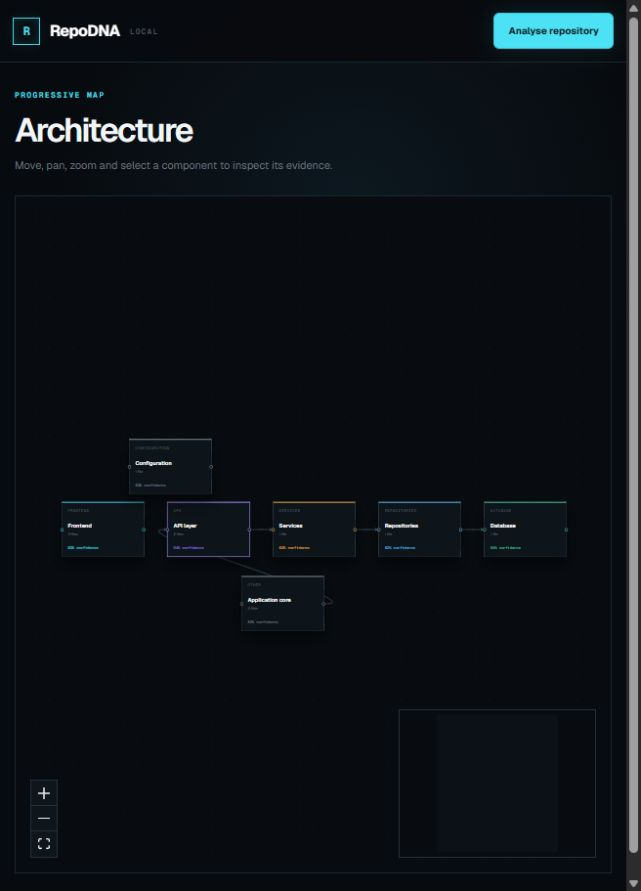
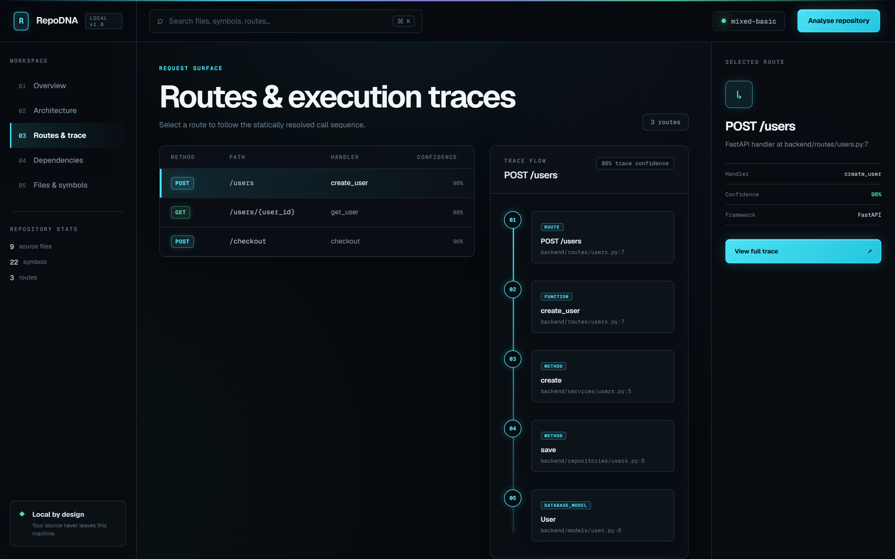
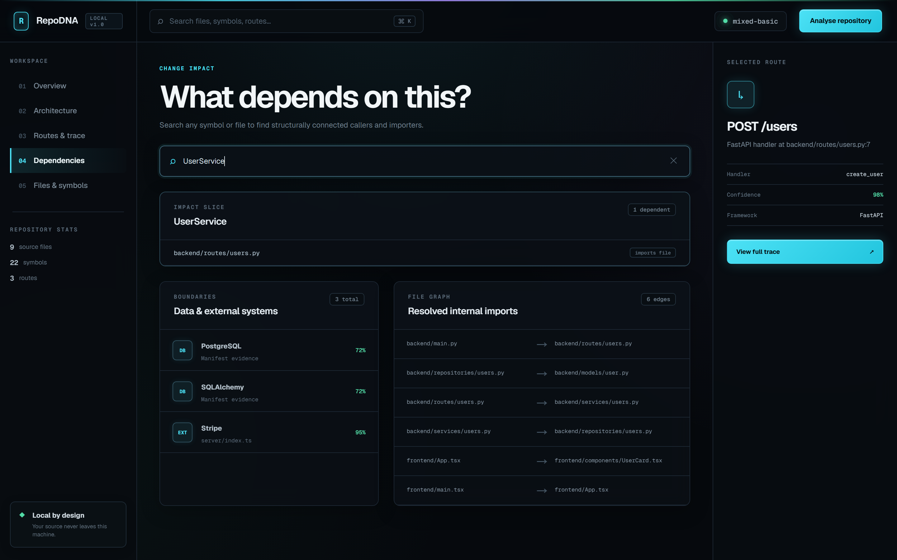

# RepoDNA

**Understand any codebase visually.**

[Open the live Vercel web application](https://repodna-one.vercel.app)

RepoDNA turns an unfamiliar Python, JavaScript, or TypeScript repository into an interactive structural map: files, symbols, imports, routes, databases, external systems, architecture layers, execution traces, impact slices, and an onboarding tour.

It is deterministic, local-first, and does not use an LLM. The analyzer reads source code as text and **never executes repository code**.

---

## Screenshots

### Repository Overview


### Interactive Architecture Map


### Route Execution Tracing


### Change Impact & Dependencies


---

## Web App & Live GitHub Analysis

You can analyze any public GitHub repository directly on the web app without installing any tools:

1. Open **[repodna-one.vercel.app](https://repodna-one.vercel.app)**
2. Paste any public GitHub repository link (e.g. `https://github.com/yusrababari/Twitter-Sentiment-Analysis`) or select a local directory.
3. RepoDNA decodes the architecture layers, execution traces, dependency graph, and entry points in seconds.

### Client-Side & Zero-Server Analysis

- **Local Folder Picker**: Select any project directory from your computer (`webkitdirectory`). All parsing runs 100% inside your browser tab.
- **Local .zip / .json Upload**: Drop a zipped source archive or an existing `repodna.json` analysis.
- **Automatic Fallback**: If server analysis is rate-limited or unavailable, the web app automatically falls back to in-browser parsing.

---

## API Specification (`/api/analyze`)

The visualizer includes a serverless API route deployed on Vercel:

### Request

- **Method**: `POST` (or `GET ?url=https://github.com/owner/repo`)
- **Headers**: `Content-Type: application/json`
- **Body**:
  ```json
  {
    "url": "https://github.com/owner/repository"
  }
  ```

### Response Formats

#### Success (`200 OK`)
```json
{
  "success": true,
  "project": {
    "schemaVersion": "1.0.0",
    "repository": { "name": "...", "languages": { ... } },
    "technologies": [ ... ],
    "files": [ ... ],
    "symbols": [ ... ],
    "imports": [ ... ],
    "routes": [ ... ],
    "architecture": { "components": [ ... ], "connections": [ ... ] },
    "metrics": { ... }
  }
}
```

#### Failure (`4xx / 5xx`)
```json
{
  "success": false,
  "error": {
    "code": "RATE_LIMITED",
    "message": "Too many repository analysis requests. Please wait 60 seconds.",
    "retryAfter": 60
  }
}
```

### HTTP Status Codes

| Status | Code | Description |
|---|---|---|
| `200` | `SUCCESS` | Repository successfully parsed and architecture resolved. |
| `400` | `INVALID_REQUEST` / `INVALID_GITHUB_URL` / `MALFORMED_JSON` / `PATH_TRAVERSAL` | Missing parameters, invalid GitHub URL, malformed JSON, or path traversal detected in archive. |
| `404` | `REPO_NOT_FOUND` | Public GitHub repository not found or repository is private. |
| `413` | `ARCHIVE_TOO_LARGE` / `EXTRACTED_TOO_LARGE` / `TOO_MANY_FILES` | Repository exceeds enforced size/count resource limits. |
| `429` | `RATE_LIMITED` | IP sliding window exceeded (5 requests per 10 min). Includes `Retry-After` header. |
| `502` | `UPSTREAM_GITHUB_ERROR` | Upstream GitHub API rate limit or gateway error. |
| `503` | `RATE_LIMIT_UNAVAILABLE` | Rate limiting infrastructure failure (fail-closed, triggers client browser fallback). |
| `504` | `FETCH_TIMEOUT` | Upstream GitHub download timed out after 20 seconds. |

---

## Enforced Resource Limits

| Limit | Maximum | Action upon breach |
|---|---|---|
| **Repository files** | 10,000 files | Returns `413 TOO_MANY_FILES` |
| **Individual file size** | 1 MB (1,000,000 bytes) | Skipped with diagnostic (`exceeds_file_size_limit`) |
| **Compressed archive** | 25 MB (26,214,400 bytes) | Returns `413 ARCHIVE_TOO_LARGE` |
| **Total extracted content** | 100 MB (104,857,600 bytes) | Returns `413 EXTRACTED_TOO_LARGE` (ZIP bomb protection) |
| **GitHub fetch timeout** | 20 seconds | Returns `504 FETCH_TIMEOUT` |
| **API rate limit** | 5 analyses / 10 min per IP | Returns `429 RATE_LIMITED` |

---

## Environment Variables

For production deployments on Vercel with Upstash Redis rate limiting:

```bash
UPSTASH_REDIS_REST_URL="https://your-upstash-redis.upstash.io"
UPSTASH_REDIS_REST_TOKEN="your-upstash-token"
```

*Note: In local development, if Upstash environment variables are omitted, the API uses an in-memory sliding window fallback.*

---

## Python CLI

You can also run analysis locally via the Python CLI:

```bash
# Install Python CLI
python -m pip install -e .

# Analyse a local repository
repodna analyse ../your-project

# Analyse a public GitHub repository
repodna analyse https://github.com/owner/repository

# Trace execution paths
repodna trace checkout

# Inspect impact of a symbol
repodna impact UserService
```

---

## Testing & Quality Assurance

### Run Frontend & Vitest Unit Tests
```bash
# Run Vitest unit tests (31 unit tests covering detection, AST, graph, ingestion, and API)
npm run test:unit

# Run ESLint + Vitest + Vinext build
npm test

# Run native Vercel Next.js build
npm run build:vercel
```

### Run Python Engine Tests
```bash
# Run Python core test suite (22 unit tests)
npm run test:python
```

---

## Safety & Privacy Model

- **Zero Code Execution**: Source files are parsed purely as text. RepoDNA never runs `npm install`, `pip install`, `eval`, application entry points, shell scripts, or build tasks.
- **Privacy First**: Source code and archive payloads are never saved to disk on the server or logged to monitoring.
- **Structured Server Logs**: Server logs contain only request IDs, anonymized IP subnets, duration, file counts, and result status codes.

---

## License

[MIT](LICENSE)
