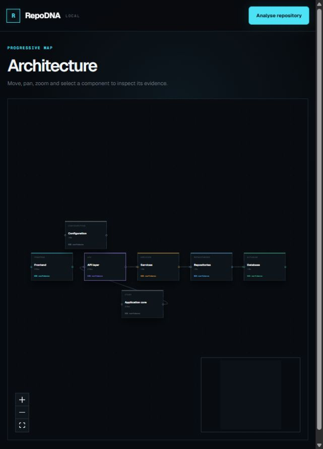

# RepoDNA

RepoDNA turns Python, JavaScript, and TypeScript repositories into interactive architecture maps. Use it to find entry points, follow dependencies, and explore how an unfamiliar codebase fits together. Go support is experimental.

[Try the web app](https://repodna-one.vercel.app) · [Local setup](#local-setup) · [Technical reference](docs/reference.md)



## How it works

The analyzer reads source as text and extracts files, symbols, imports, routes, and relationships. The viewer lets you inspect architecture layers, trace inferred calls, and explore the possible impact of a change. It does not execute repository code or use an LLM.

- Analyze a public GitHub repository, or use the browser to inspect a local folder or ZIP archive.
- Explore the graph and save its layout locally.
- Export graph data as JSON, CSV, Neo4j Cypher, or Parquet where enabled.
- Connect GitHub for private-repository analysis through the hosted application's authentication flow.

## Engineering decisions

**Static analysis with explicit limits.** Parsing has file, byte, syntax-tree, and graph budgets. Dynamic imports and runtime behavior cannot always be resolved; the results include uncertainty and coverage information. See the [analysis limitations](docs/analysis-limitations.md).

**Browser and server analysis.** Local folders can be parsed in the browser. Public deep scans can use the server workflow for larger repositories and commit-addressed results. Shared Python and TypeScript capabilities are checked against common fixtures. See the [architecture decisions](docs/adr/) and [contributor guide](CONTRIBUTING.md).

## Local setup

Use Node.js 22.13 or later and npm. Python 3.11 or later is required for the Python engine and cross-engine tests.

```bash
git clone https://github.com/AnasBabari/RepoDNA.git
cd RepoDNA
npm ci
npm run dev
```

Open the local URL printed by the development server. Local folder analysis is the simplest way to try the analyzer without configuring hosted services. GitHub authentication, hosted analysis, caching, and rate limiting have additional configuration described in the [technical reference](docs/reference.md#environment-variables) and [.env.example](.env.example).

For Python development, install the engine in a virtual environment with `python -m pip install -e .`. The [contributor guide](CONTRIBUTING.md) lists the test commands and prerequisites.

## Limits

A static map is not a runtime trace. Reflection, generated routes, and dynamic dependency injection can leave relationships unresolved. Large graphs may be compacted for display; check the result's coverage and completeness fields before drawing conclusions.

## Documentation

- [API, exports, resource limits, and configuration](docs/reference.md)
- [Analysis limitations](docs/analysis-limitations.md)
- [Graph export formats](docs/graph-exports.md)
- [Security policy](SECURITY.md) and [threat model](docs/threat-model.md)
- [Contributing and tests](CONTRIBUTING.md)
- Other views: [repository overview](docs/screenshots/overview.png), [route tracing](docs/screenshots/routes-trace.png), and [dependencies](docs/screenshots/dependencies.png)

## License

[MIT](LICENSE)
